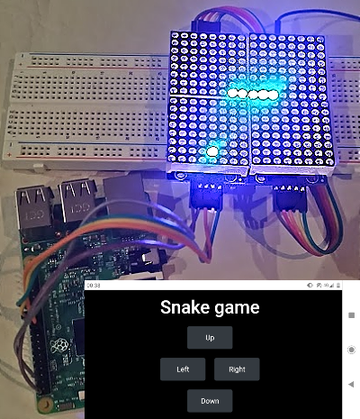

# Retro Snake

Permite mostrar el clásico juego Snake en una matriz de leds a través de una [Raspberry Pi](http://raspberrypi.org/). Es controlado por un smarthphone o cualquier dispositivo con un navegador inalambricamente.

    

## Prerequisitos
 - [Python 3](https://www.python.org/)
 
## Instalación
Se recomienda utilizar un [virtual environment](https://virtualenv.pypa.io/en/latest/) para realizar la instalación.

    $ pip install -r requirements.txt

Si se está instalando en la Raspberry Pi, además seguir las instrucciones [aquí](https://luma-led-matrix.readthedocs.io/en/latest/install.html).

## Ejecución

    $ python -m retro_snake.serve

Si la matriz está conectada se lanza en la matriz, en otro caso abre un emulador. Luego se puede controlar accediendo a [localhost:5000](http://localhost:5000/).
