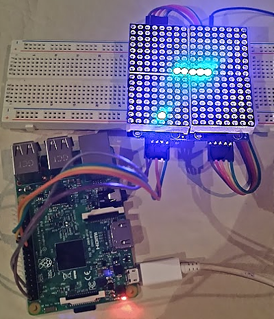

# Retro Snake

Permite controlar y mostrar el clásico juego Snake en una matriz de leds a través de una [Raspberry Pi](http://raspberrypi.org/).

    

## Instalación
 Se recomienda utilizar un [virtual environment](https://virtualenv.pypa.io/en/latest/) para realizar la instalación.

    $ pip install -r requirements.txt

## Ejecución

    $ python -m retro_snake.serve

Si la matriz está conectada se lanza en la matriz, en otro caso abre un emulador. Luego se puede controlar accediendo a [localhost:5000](hhttp://localhost:5000/).
